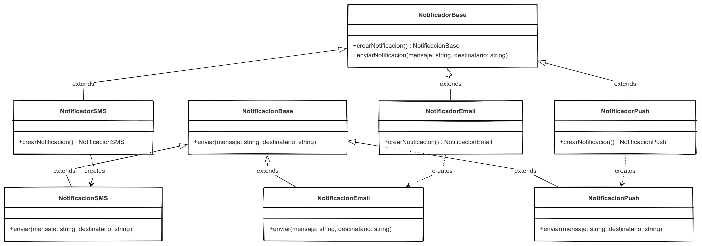
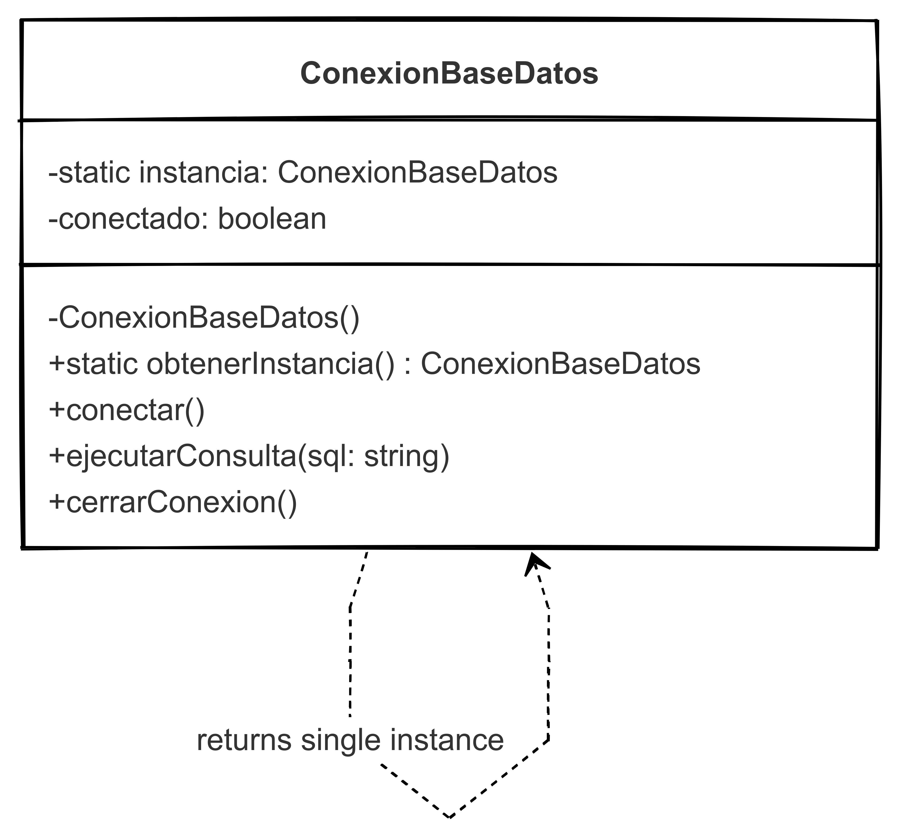
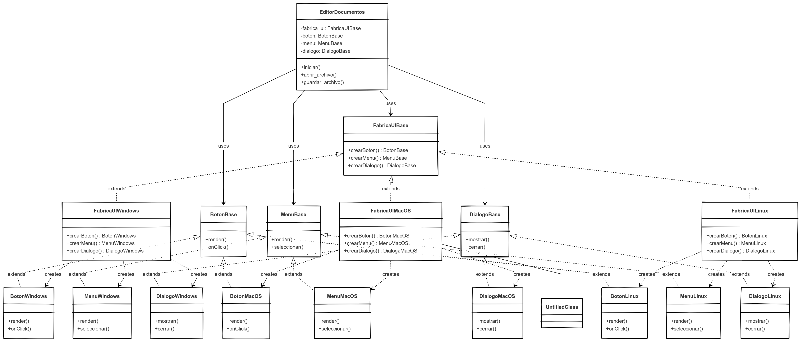

# Problema 1: Sistema de Notificaciones para Aplicación Móvil
Patrón Creacional: Factory Method
Una aplicación móvil necesita enviar diferentes tipos de notificaciones (SMS, correo electrónico, push notifications) dependiendo de las preferencias del usuario y la importancia del mensaje.
### Justificación:
El patrón Factory Method permite crear objetos sin especificar la clase exacta del objeto a crear. En este caso, necesitamos crear diferentes tipos de notificaciones sin acoplar el código que las utiliza a las clases concretas de notificación. Esto facilita:

Añadir nuevos tipos de notificaciones sin modificar el código existente (Principio Abierto/Cerrado)
Centralizar la lógica de creación de notificaciones
Permitir que cada tipo de notificación tenga su propia implementación específica

# Problema 2: Conexión a Bases de Datos en Sistema de Gestión Empresarial
## Patrón Creacional: Singleton
Un sistema de gestión empresarial necesita mantener una única conexión a la base de datos para evitar sobrecarga de conexiones y garantizar que todas las operaciones compartan el mismo estado de transacción cuando sea necesario.
### Justificación:
El patrón Singleton garantiza que una clase tenga una única instancia y proporciona un punto de acceso global a ella. Para la conexión a base de datos, esto es crucial porque:

Evita múltiples conexiones innecesarias que consumen recursos
Garantiza consistencia en las operaciones de base de datos
Proporciona un punto centralizado para gestionar la conexión
Facilita la implementación de un pool de conexiones si fuera necesario escalar

# Problema 3: Editor de Documentos Multiplataforma
## Patrón Creacional: Abstract Factory
Un editor de documentos debe funcionar en diferentes sistemas operativos (Windows, macOS, Linux) manteniendo una interfaz consistente pero adaptándose al estilo visual y comportamiento de cada plataforma.
### Justificación:
El patrón Abstract Factory permite crear familias de objetos relacionados sin especificar sus clases concretas. Para el editor multiplataforma:

Permite crear componentes UI (botones, menús, diálogos) que mantienen coherencia visual con la plataforma
Facilita cambiar toda la familia de componentes al cambiar de plataforma
Aísla el código específico de la plataforma del resto de la aplicación
Hace que agregar soporte para una nueva plataforma sea más sencillo

# Diagramas

Explicación de los diagramas:
## 1. Factory Method (Sistema de Notificaciones)

Creator (NotificadorBase): Define el método factory abstracto para crear notificaciones
ConcreteCreators (NotificadorSMS, NotificadorEmail, NotificadorPush): Implementan el método factory para crear notificaciones específicas
Product (NotificacionBase): Define la interfaz para los objetos que crea el factory method
ConcreteProducts (NotificacionSMS, NotificacionEmail, NotificacionPush): Implementan la interfaz específica para cada tipo de notificación

## Diagrama UML de Factory Method

## 2. Singleton (Conexión a Base de Datos)

Singleton (ConexionBaseDatos): Contiene una instancia estática de sí misma, un constructor privado y un método público para obtener la instancia
Proporciona métodos adicionales para ejecutar consultas y cerrar la conexión
Garantiza que solo exista una instancia en toda la aplicación

## Diagrama UML de Singleton

## 3. Abstract Factory (Editor de Documentos Multiplataforma)

AbstractFactory (FabricaUIBase): Define la interfaz para crear familias de productos relacionados
ConcreteFactories (FabricaUIWindows, FabricaUIMacOS, FabricaUILinux): Implementan la creación de productos específicos para cada plataforma
AbstractProducts (BotonBase, MenuBase, DialogoBase): Definen interfaces para cada tipo de producto
ConcreteProducts (BotonWindows, MenuMacOS, etc.): Implementan las interfaces para cada plataforma específica

## Diagrama UML de Abstract Factory

# Análisis de la implementación
## Implementación de Factory Method
Esta implementación sigue el principio de responsabilidad única (SRP) al separar la creación de notificaciones de su implementación. También respeta el principio de sustitución de Liskov (LSP) ya que cualquier notificación concreta puede usarse donde se espera una NotificacionBase.
Características clave:

Definición clara de interfaces abstractas para creadores y productos
Implementación de variantes concretas para cada tipo de notificación
Delegación de la creación de objetos a subclases específicas

# Implementación de Singleton
El patrón Singleton está implementado utilizando el método __new__ de Python para controlar la creación de instancias. Esto garantiza que solo exista una instancia de la conexión a la base de datos en toda la aplicación.
Características clave:

- Control centralizado de la instancia única
- Acceso global a la instancia a través de la clase
- Inicialización perezosa (lazy initialization) para optimizar recursos

# Implementación de Abstract Factory
La implementación del Abstract Factory muestra cómo crear familias completas de objetos relacionados (componentes UI) para diferentes plataformas. Sigue el principio de inversión de dependencias (DIP) al depender de abstracciones en lugar de implementaciones concretas.
Características clave:

Jerarquía clara de interfaces abstractas para fábricas y productos
Implementaciones concretas por plataforma que mantienen la coherencia interna
Cliente (EditorDocumentos) que trabaja exclusivamente con interfaces abstractas

Cada implementación sigue los principios SOLID:

- Single Responsibility: Cada clase tiene una única responsabilidad
- Open/Closed: Se pueden añadir nuevas variantes sin modificar el código existente
- Liskov Substitution: Las subclases pueden sustituir a sus clases base
- Interface Segregation: Las interfaces están específicamente diseñadas para sus usuarios
- Dependency Inversion: Dependencia de abstracciones, no de implementaciones concretas